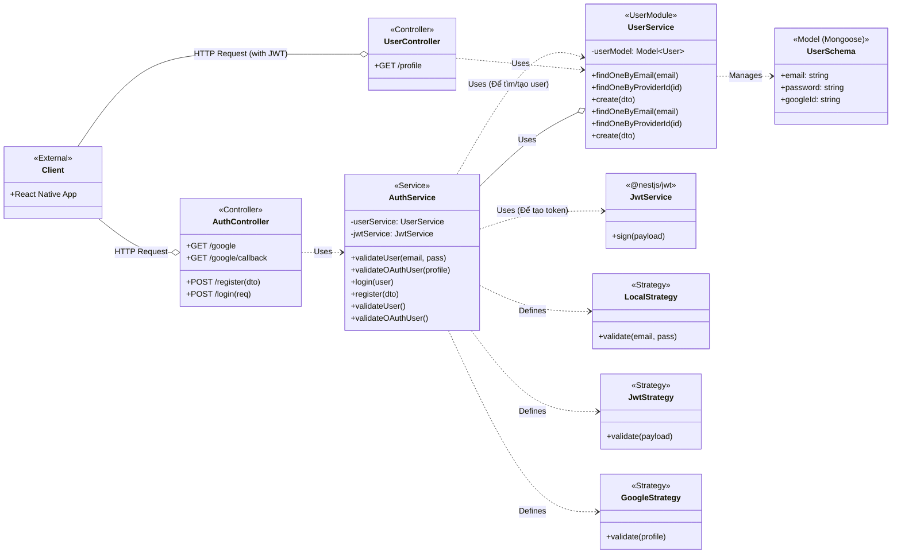

```mermaid

classDiagram
    direction LR
    
    Client --o AuthController : HTTP Request
    AuthController ..> AuthService : Uses
    
    AuthService ..> UserService : Uses (Để tìm/tạo user)
    AuthService ..> JwtService : Uses (Để tạo token)
    AuthService ..> LocalStrategy : Defines
    AuthService ..> JwtStrategy : Defines
    AuthService ..> GoogleStrategy : Defines

    class Client {
        <<External>>
        +React Native App
    }

    class AuthController {
        <<Controller>>
        +POST /register(dto)
        +POST /login(req)
        +GET /google
        +GET /google/callback
    }

    class AuthService {
        <<Service>>
        -userService: UserService
        -jwtService: JwtService
        +validateUser(email, pass)
        +validateOAuthUser(profile)
        +login(user)
        +register(dto)
    }

    class UserService {
        <<UserModule>>
        +findOneByEmail(email)
        +findOneByProviderId(id)
        +create(dto)
    }
    
    class JwtService {
        <<@nestjs/jwt>>
        +sign(payload)
    }

    class LocalStrategy {
        <<Strategy>>
        +validate(email, pass)
    }
    class JwtStrategy {
        <<Strategy>>
        +validate(payload)
    }
    class GoogleStrategy {
        <<Strategy>>
        +validate(profile)
    }


    %% direction LR

    Client --o UserController : HTTP Request (with JWT)
    UserController ..> UserService : Uses
    UserService ..> UserSchema : Manages
    
    AuthService --o UserService : Uses


    class UserController {
        <<Controller>>
        +GET /profile
    }

    class UserService {
        <<Service>>
        -userModel: Model~User~
        +findOneByEmail(email)
        +findOneByProviderId(id)
        +create(dto)
    }

    class UserSchema {
        <<Model (Mongoose)>>
        +email: string
        +password: string
        +googleId: string
    }
    
    class AuthService {
        <<AuthModule>>
        +validateUser()
        +validateOAuthUser()
    }
```