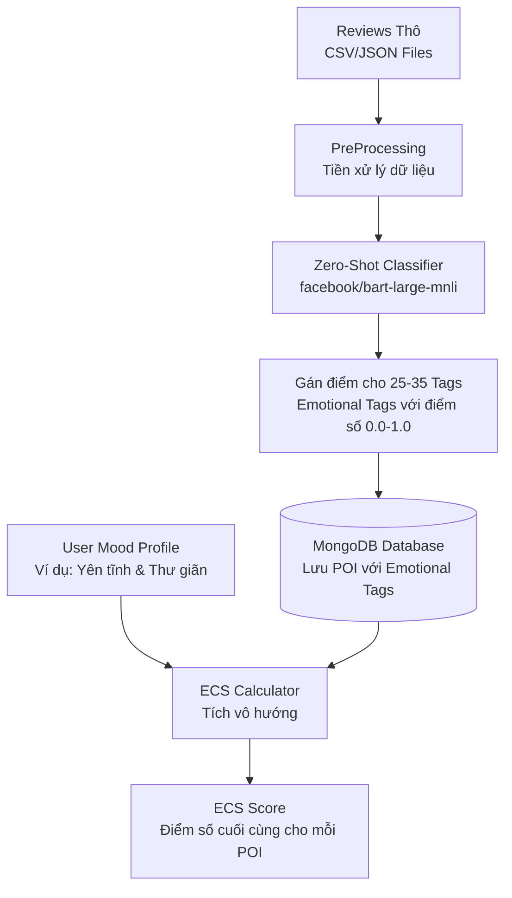

```mermaid
graph TD
    A[Reviews Thô<br/>CSV/JSON Files] --> B[PreProcessing<br/>Tiền xử lý dữ liệu]
    B --> C[Zero-Shot Classifier<br/>facebook/bart-large-mnli]
    C --> D[Gán điểm cho 25-35 Tags<br/>Emotional Tags với điểm số 0.0-1.0]
    D --> E[(MongoDB Database<br/>Lưu POI với Emotional Tags)]
    
    F[User Mood Profile<br/>Ví dụ: Yên tĩnh & Thư giãn] --> G[ECS Calculator<br/>Tích vô hướng]
    E --> G
    G --> H[ECS Score<br/>Điểm số cuối cùng cho mỗi POI]
```
