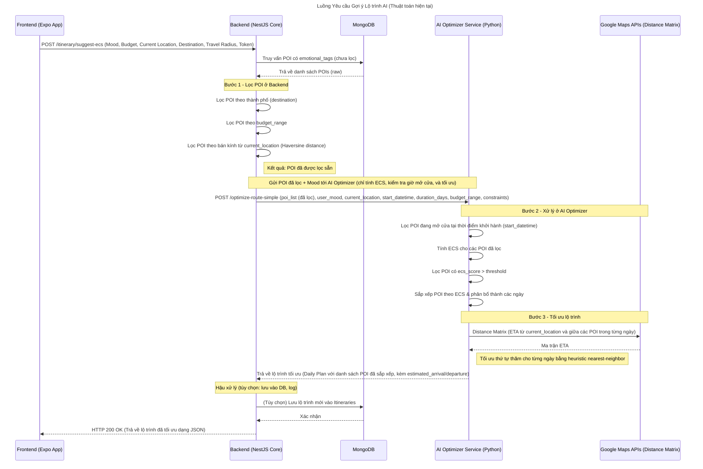

```mermaid
sequenceDiagram
    participant FE as Frontend (Expo App)
    participant BE as Backend (NestJS Core)
    participant DB as MongoDB
    participant AI as AI Optimizer Service (Python)
    participant GM as Google Maps APIs (Distance Matrix)

    title Luồng Yêu cầu Gợi ý Lộ trình AI (Thuật toán hiện tại)

    FE->>BE: POST /itinerary/suggest-ecs (Mood, Budget, Current Location, Destination, Travel Radius, Token)
    BE->>DB: Truy vấn POI có emotional_tags (chưa lọc)
    DB-->>BE: Trả về danh sách POIs (raw)

    Note over BE: Bước 1 - Lọc POI ở Backend
    BE->>BE: Lọc POI theo thành phố (destination)
    BE->>BE: Lọc POI theo budget_range
    BE->>BE: Lọc POI theo bán kính từ current_location (Haversine distance)
    Note right of BE: Kết quả: POI đã được lọc sẵn

    Note over BE,AI: Gửi POI đã lọc + Mood tới AI Optimizer (chỉ tính ECS, kiểm tra giờ mở cửa, và tối ưu)

    BE->>AI: POST /optimize-route-simple (poi_list (đã lọc), user_mood, current_location, start_datetime, duration_days, budget_range, constraints)

    Note over AI,GM: Bước 2 - Xử lý ở AI Optimizer
    AI->>AI: Lọc POI đang mở cửa tại thời điểm khởi hành (start_datetime)
    AI->>AI: Tính ECS cho các POI đã lọc
    AI->>AI: Lọc POI có ecs_score > threshold
    AI->>AI: Sắp xếp POI theo ECS & phân bổ thành các ngày

    Note over AI,GM: Bước 3 - Tối ưu lộ trình
    AI->>GM: Distance Matrix (ETA từ current_location và giữa các POI trong từng ngày)
    GM-->>AI: Ma trận ETA
    Note right of AI: Tối ưu thứ tự thăm cho từng ngày bằng heuristic nearest-neighbor

    AI-->>BE: Trả về lộ trình tối ưu (Daily Plan với danh sách POI đã sắp xếp, kèm estimated_arrival/departure)

    Note over BE: Hậu xử lý (tùy chọn: lưu vào DB, log)
    BE->>DB: (Tùy chọn) Lưu lộ trình mới vào Itineraries
    DB-->>BE: Xác nhận

    BE-->>FE: HTTP 200 OK (Trả về lộ trình đã tối ưu dạng JSON)
```