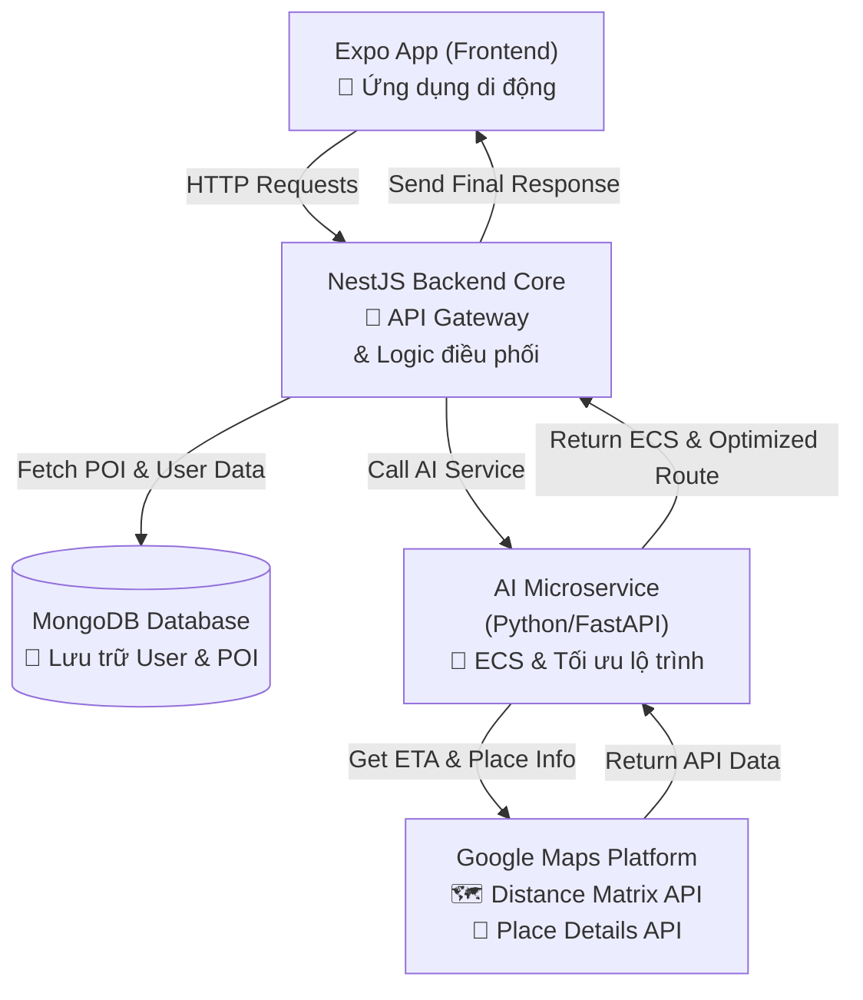

```mermaid
graph TD
    A["Expo App (Frontend)<br/>📱 Ứng dụng di động"] -->|"HTTP Requests"| B["NestJS Backend Core<br/>🔧 API Gateway<br/>& Logic điều phối"]
    B -->|"Fetch POI & User Data"| C[("MongoDB Database<br/>💾 Lưu trữ User & POI")]
    B -->|"Call AI Service"| D["AI Microservice<br/>(Python/FastAPI)<br/>🤖 ECS & Tối ưu lộ trình"]
    D -->|"Get ETA & Place Info"| E["Google Maps Platform<br/>🗺️ Distance Matrix API<br/>📍 Place Details API"]
    E -->|"Return API Data"| D
    D -->|"Return ECS & Optimized Route"| B
    B -->|"Send Final Response"| A
```
