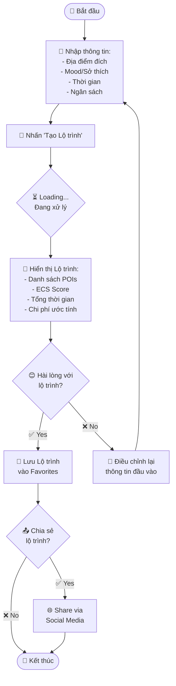

```mermaid
flowchart TD
    Start(["🚀 Bắt đầu"]) --> Input["📝 Nhập thông tin:<br/>- Địa điểm đích<br/>- Mood/Sở thích<br/>- Thời gian<br/>- Ngân sách"]
    
    Input --> Generate["🔘 Nhấn 'Tạo Lộ trình'"]
    
    Generate --> Loading{"⏳ Loading...<br/>Đang xử lý"}
    
    Loading --> Display["📍 Hiển thị Lộ trình:<br/>- Danh sách POIs<br/>- ECS Score<br/>- Tổng thời gian<br/>- Chi phí ước tính"]
    
    Display --> Decision{"😊 Hài lòng với<br/>lộ trình?"}
    
    Decision -->|"✅ Yes"| Save["💾 Lưu Lộ trình<br/>vào Favorites"]
    Decision -->|"❌ No"| Modify["🔄 Điều chỉnh lại<br/>thông tin đầu vào"]
    
    Modify --> Input
    
    Save --> Share{"📤 Chia sẻ<br/>lộ trình?"}
    
    Share -->|"✅ Yes"| ShareAction["🌐 Share via<br/>Social Media"]
    Share -->|"❌ No"| End
    
    ShareAction --> End(["🏁 Kết thúc"])
```
